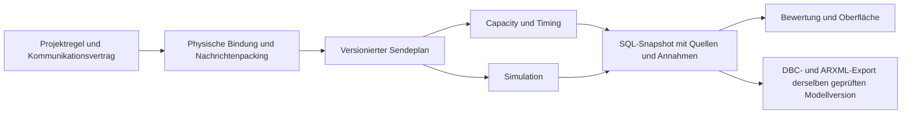

# Kommunikationsmodell, Busvergabe und neue Bewertung

Stand: 10.09.2026. Projekt: `network-project-20260910042736034-d11591d0`.

**Ergebnis:** Die bisherigen Warnungen beruhen teilweise auf fehlerhaften Generatorvorgaben. Eine richtige Bewertung benötigt zuerst verbindliche Sendemodi und Timing-Anforderungen und anschließend das passende Busmodell. Das bloße Serialisieren der Übertragungen behebt einen zu großen Kapazitätsbedarf nicht.

Die folgenden Szenariotabellen dokumentieren den ursprünglichen Untersuchungsstand. Inzwischen ist die gemeinsame automatische Zyklusdimensionierung für CAN und LIN implementiert: Wizard, Capacity, SQL-Übernahme, Simulation und Intelligence verwenden denselben Vertrag. Den produktiven Stand, die Prüfungen und die ausdrücklich verbleibenden Grenzen dokumentiert [Kommunikationsdimensionierung](I:/PycharmProjects/My_first_Network_Simulator/docs/communication-dimensioning-verification-2026-09-10.md). Die Szenariozahlen unten sind keine aktuellen Projektergebnisse.

## 1. Projektvorgabe und Protokollregeln

| Aussage | Geprüfte Einordnung | Folge für NIS |
| --- | --- | --- |
| Wichtige Nachrichten mindestens 20 ms auseinander | Vom Nutzer ausdrücklich als **Mindest-Sendeabstand** bestätigt. Keine allgemeine CAN-/LIN-Protokollgrenze. | Konfigurierbare Projektregel; eine Aktualitätsanforderung beim Empfänger ist ein eigenes Feld. |
| Zustände bei Änderung oder Anfrage senden | Sinnvolles Profil, aber die Signalart allein legt den Sendemodus nicht fest. | Ereignis, Anfrage, Zyklus und optionaler Heartbeat werden getrennt festgelegt. |
| Auf freiem CAN-Bus senden | CAN erlaubt konkurrierende Sendewünsche. Die Arbitrierung entscheidet über den nächsten Frame. | Laufender Frame wird nicht unterbrochen; wartende Nachrichten werden nach tatsächlicher CAN-Arbitrationspriorität berücksichtigt. |
| LIN-Teilnehmer prüfen selbst und senden dann | Für normalen LIN-Verkehr bestimmt der Master die Reihenfolge. | Master, Pollplan und Sendeplätze sind erforderlich. |
| Phasenversatz verhindert Überlast | Er kann Wartezeiten und Lastspitzen vermindern. Er ändert die insgesamt benötigte Sendezeit nicht. | Mittlere Last, Belegung pro Zeitfenster und Deadline-Erfüllung getrennt bewerten. |

AUTOSAR unterscheidet periodische, direkte/ereignisgesteuerte und gemischte Übertragung; Zyklus und Mindestverzögerung sind konfigurierbar. „20 ms“ ist daher hier eine Projektentscheidung. Ein Zustand kann außerdem in einer ohnehin zyklischen Nachricht mitgesendet werden. [AUTOSAR COM R25-11, ComTxModeTimePeriod](https://www.autosar.org/fileadmin/standards/R25-11/CP/AUTOSAR_CP_SWS_COM.pdf), [AUTOSAR COM R23-11, Abschnitt 7.3.3.1](https://www.autosar.org/fileadmin/standards/R23-11/CP/AUTOSAR_CP_SWS_COM.pdf).

Bei CAN können mehrere Knoten nach Freiwerden des Busses gleichzeitig beginnen; die verlierenden Sender geben während der Arbitrierung auf. Danach wird der Datenframe des Gewinners übertragen. Das ist keine garantierte globale Zeitschlitzplanung. [Analog Devices AN-1123, Arbitration](https://www.analog.com/en/resources/app-notes/an-1123.html).

LIN verwendet einen Master-Zeitplan. Auch ereignisgesteuerte LIN-Frames werden vom Master angefordert; bei mehreren Antworten ist ein Auflösungsplan erforderlich. Sendeplätze müssen die maximale Rahmendauer und Master-Jitter abdecken. [LIN 2.2A, Abschnitte 2.3.3 und 2.4](https://community.nxp.com/pwmxy87654/attachments/pwmxy87654/16-bit/18786/3/LIN_Specification_Package_2.2A.pdf).

„Auf Anfrage“ ist eine Anwendungsbeziehung mit Anfrage und Antwort. CAN-FD besitzt keine nativen Remote-Frames im FD-Format; eine Antwortanforderung muss daher als Anwendungsnachricht modelliert werden. [Microchip, CAN FD Message Frames](https://onlinedocs.microchip.com/oxy/GUID-D6315DA4-4399-4D39-80F4-F1F66A173640-en-US-2/GUID-19E7A743-7308-43BF-83F0-118135AC4C39.html).

## 2. Nachgewiesene Herkunft im Projekt

- **89 von 311 Nachrichten** besitzen gespeicherte Zyklen unter 20 ms. Die [Automotive-Vorlagen](I:/PycharmProjects/My_first_Network_Simulator/frontend/src/lib/agent/industry-templates/automotive.ts:4) setzen beispielsweise Raddrehzahl und Bremsdruck auf 5 ms, Federweg und Dämpferposition auf 10 ms. Radar und Kamera stehen bereits auf 20 ms. Diese Werte stammen aus Vorlagen.
- [Frontend-Generator](I:/PycharmProjects/My_first_Network_Simulator/frontend/src/lib/agent/engineering-specification.ts:558) und [Backend-Generierung](I:/PycharmProjects/My_first_Network_Simulator/backend/engineering/workloads/handlers.py:371) versehen auch diskrete Signale pauschal mit zyklischer Kommunikation. **116 von 216 STATE-Signalen** tragen explizit `cyclic` oder `cyclic_fast`; für die übrigen ist daraus kein Ereignisprofil ableitbar.
- Die vorhandenen 311 `communication_contract`-Datensätze dokumentieren Produzent, Empfänger und Rolle. Es gibt **keinen expliziten Transmission-Vertrag** mit Ereignisrate, Anfragebeziehung und Sendemodus. Rollen: 109 Messnachrichten, 52 Gerätestatus, 100 Rückmeldungen, 50 explizite Empfängerzuordnungen. Eine Rolle ist noch kein Sendemodus.
- Capacity und Simulation wählen derzeit über `_requirement_value` den kleinsten vorhandenen Zyklus aus mehreren Kopien. Eine Änderung ausschließlich an `Message.cycle_ms` kann deshalb von einem alten 5-ms-Wert am Signal oder an der Route wieder aufgehoben werden. Betroffen: [Capacity](I:/PycharmProjects/My_first_Network_Simulator/backend/engineering/capacity/service.py:307) und [Simulation](I:/PycharmProjects/My_first_Network_Simulator/backend/engineering/simulation.py:129).
- Der bisherige LIN-Check prüft eine gleichzeitige Bereitstellung aller Frames als konservatives Szenario. Das ist kein Nachweis, dass der tatsächliche Master-Pollplan seine Deadlines verletzt. Die Beschriftung und Bewertung vermischen diese Annahme mit der realen Planung.

**Nutzerklarstellung vom 10.09.2026:** DBC und ARXML sind die am Ende zu erzeugenden Ausgabeformate. Die fachlichen Vorgaben werden im kanonischen Projektmodell erarbeitet, bestätigt und geprüft. Vorhandene DBC-/ARXML-Dateien sind für diesen Ablauf keine Voraussetzung; ihr Fehlen ist kein offener Eingang oder Blocker. Eventuelle spätere Importe sind ein eigener Anwendungsfall.

Für die Fortsetzung gilt dieses kompakte Regelregister:

| Kennung | Quelle und Stand | Geltung / Verbindlichkeit | Auswirkung |
| --- | --- | --- | --- |
| COM-01 | Nutzerantwort vom 10.09.2026: „Sendeabstand mindestens 20 ms“ | Bestätigte Vorgabe dieses Projekts | Konfigurierbare Untergrenze; nicht als allgemeine Protokollgrenze verwenden. |
| COM-02 | Nutzerbeschreibung vom 10.09.2026 zu Zuständen und Anfragen | Gewünschtes Projektprofil; konkrete Auslöser und Raten noch zu spezifizieren | Kein pauschaler schneller Statuszyklus. |
| COM-03 | `docs/technology_bindings/04_BINDING_CONTRACT.md` und `05_GENERATOR_CONTRACT.md`, gelesen 10.09.2026 | Bestehende lokale Architekturverträge; keine Versionskennung angegeben | Physische Referenzen erhalten, Registry-basierte Generatoren und gemeinsame Transportrepräsentation. |
| COM-04 | LIN 2.2A und AUTOSAR COM, Quellen in Abschnitt 1 | Technische Grundlage für jeweiliges Protokoll; kein Beleg für projektspezifische Perioden | CAN-Arbitrierung, LIN-Masterplan und Anwendungsauslöser unterscheiden. |
| COM-05 | Technische Ableitung dieser Prüfung, 10.09.2026 | In der neuen Zyklusprüfung umgesetzt | Fehlende Sendemodelle und Zeitnachweise als unvollständig kennzeichnen. |
| COM-06 | Nutzerklarstellung vom 10.09.2026: DBC und ARXML sollen am Schluss herauskommen | Bestätigte Zielrichtung dieses Projekts | Geprüftes kanonisches Modell ist die Quelle; DBC und ARXML sind daraus erzeugte Exportartefakte. |

| COM-07 | Nutzerfreigabe vom 10.09.2026: automatische Dimensionierung, bei Bedarf 50 ms, CAN deterministisch prüfen und Intelligence einbinden | Bestätigter Arbeitsauftrag | Varianten automatisch prüfen; echte Grenzwerte erhalten; Ergebnisse erklären und als erneut zu prüfende Erfahrung speichern. |

## 3. Umsetzung: ein verbindlicher Übertragungsvertrag

Der bestehende `Message.configuration.communication_contract` wird versioniert erweitert. Alle Verbraucher lösen daraus denselben physischen Sendeplan auf. Eine separate, nur in Capacity wirksame 20-ms-Korrektur wäre falsch.

| Bestandteil | Zu speichern und zu prüfen |
| --- | --- |
| Projektregel | `minimum_application_send_interval_ms = 20`, Geltungsbereich und Nutzerquelle; in Projekteinstellungen editierbar. Keine Übertragung dieser Vorgabe auf andere Branchenprojekte. |
| Auslöser | Zyklisch, bei Änderung, auf Anfrage oder eine explizite Kombination. Semantik NUMERIC/STATE bleibt unabhängig. |
| Periodische Sendung | Periode, Startversatz und zulässiger Release-Jitter. Neu generierte Zyklen müssen die Projektuntergrenze einhalten. |
| Ereignis | Auslösendes Signal, Flanken-/Änderungsbedingung, erwartete Rate, begrenzte Ereignisanzahl pro Zeitfenster, Entprellung sowie Wiederholungsregeln. |
| Anfrage | Konkrete Anfrage- und Antwortnachricht, Partner, Korrelation, Anfragerate und Antwortfrist; beide Übertragungen zählen. |
| Heartbeat | Optional und ausdrücklich begründet. Kein versteckter zyklischer Standard für jeden Zustand. |
| Wartende Werte | Festlegen, ob Zwischenstände zusammengefasst werden dürfen oder jedes Ereignis erhalten bleiben muss. Keine stillen Ereignisverluste durch die 20-ms-Begrenzung. |
| Empfängeranforderung | Deadline, maximale Datenalterung, Timeout und Jitter getrennt von Periode und Mindestabstand. |
| Herkunft | Pro Feld: importiert, Nutzervorgabe, Projektprofil oder Vorschlag; Begründung und Review-Status. |

Der Mindestabstand betrifft neue Anwendungssendungen derselben Nachricht. CAN-Fehlerbehandlung und protokollbedingte Wiederholungen dürfen nicht künstlich um 20 ms verzögert werden; ihre zusätzliche Last wird separat bilanziert. Bei mehreren innerhalb der Sperrzeit eintreffenden Ereignissen braucht das Modell eine definierte Zusammenfassungs- oder Warteschlangenregel. Eine Sendeobergrenze allein begrenzt nicht die Wartezeit aller eintreffenden Ereignisse.

Ein Messwert ist nicht automatisch zyklisch und ein Zustand nicht automatisch rein ereignisgesteuert. Als prüfbare Projektprofile eignen sich:

- Regelmäßig benötigte Messwerte: zyklisch, mindestens 20 ms, langsamere bestehende Vorgaben erhalten.
- Gerätezustand: bei Änderung und auf Anfrage; Heartbeat nur bei entsprechender Überwachungsanforderung.
- Ausführungsbestätigung eines Aktors: nach der Aktion beziehungsweise bei Fehler, auf einen Befehl korreliert.
- Kontinuierlicher Positions-Istwert eines Aktors: eigenes Messwertprofil gemäß Regelungsanforderung.

Ein Alive-Counter zählt tatsächliche Sendungen und darf eine ereignisgesteuerte Nachricht nicht durch seine eigene Änderung ständig neu auslösen. Bei gemeinsam verpackten Signalen wird der Frame einmal für die vereinigten Auslöser gesendet. Falls eine zyklische Messgröße und ein seltenes Statussignal gemeinsam liegen, kann der Status weiterhin zyklisch mitfahren; Einsparungen entstehen erst durch bewusstes Packing beziehungsweise getrennte Nachrichten.

## 4. Umsetzung: physischer Sendeplan und Busmodell

Der Plan wird pro physischem Netz, Senderanschluss und Nachricht aufgebaut. Empfänger werden als Teilnehmer derselben Sendung geführt. Identische Broadcast-Sendungen dürfen nicht je Empfängerroute multipliziert werden. Unterschiedliche Nachrichten erhalten jeweils ihre eigene Rahmenlänge und Periode; die aktuelle Summe mehrerer DLCs darf nicht zu einem künstlichen Frame mit dem schnellsten Zyklus werden.

Für CAN/CAN-FD enthält der Plan echte Identifier und Frameformate, nominale und Datenbitrate, vollständigen Overhead, Release-Zeiten und Warteschlangen. Die nächste Busvergabe richtet sich nach den zur Freigabezeit wartenden Nachrichten. Laufende Frames werden nicht präemptiert. Konfigurierte Phasen werden in der Simulation eingehalten; eine garantierte Worst-Case-Aussage benötigt darüber hinaus eine passende Antwortzeitanalyse samt Annahmen zu Jitter, Fehlern und Wiederholungen.

Für LIN wird ein eigener Sendeplan mit Master, Zeitbasis, Frame-ID, Herausgeber, Typ und Slotdauer erstellt und gespeichert. Freie Zeit bleibt frei; Zustandsänderungen erzeugen nicht eigenständig einen LIN-Frame. Leere Polls, Antworten, Diagnoseverkehr und die Auflösung von Event-Frame-Kollisionen sind zu berücksichtigen. Ein generisches FIFO für alle Protokolle ersetzt diesen Plan nicht.

Für geswitchtes Full-Duplex-Ethernet wird weiter pro Port und Richtung gerechnet. Der Grundsatz „nur eine Übertragung auf dem gesamten Netzwerk“ ist dafür kein geeignetes Modell. Kamera-/Radarnamen dürfen zudem nicht über die Nutzlast hinwegtäuschen: „Front Camera“ enthält aktuell nur **3 Byte** pro Nachricht. Das kann einen synthetischen Kennwert darstellen, aber keinen belegten Videodatenstrom. Für echte Bild- oder Objektdaten sind Datenumfang, Rate und Paketierung separat zu spezifizieren.

Die bereits vorhandenen Verträge [Technology Binding](I:/PycharmProjects/My_first_Network_Simulator/docs/technology_bindings/04_BINDING_CONTRACT.md) und [Generator](I:/PycharmProjects/My_first_Network_Simulator/docs/technology_bindings/05_GENERATOR_CONTRACT.md) bleiben maßgeblich: Bindungen tragen physische Referenzen; Generatoren und Rechner werden über die Registry aufgelöst. Der Wizard erhält keine weitere verstreute Protokoll-Sonderlogik.

## 5. LIN-/CAN-Widerspruch richtig behandeln

Die im alten Audit verwendete Darstellung „LIN-Zweig, can-fd-S01“ war missverständlich. Die Tabelle ist korrigiert. Öffentlich erscheinen **Busanzeigename, wirksamer Bustyp und Bitrate**, etwa `Bremsregelung LIN 01 · LIN · 19.200 bit/s`. Die alte technische ID bleibt in den technischen Details nachvollziehbar.

Vor einer Bewertung müssen `Network.technology`, physische Anschlüsse, Kommunikationsschnittstellen, Technology Binding und aufgelöste Routenprotokolle zusammenpassen. Ein Widerspruch führt zu `MODEL_INCONSISTENT`; der Rechner darf dann nicht unbemerkt eine Variante auswählen. Eine historische Text-ID allein ist kein Protokollbeweis und darf keine automatische Umstellung auf CAN-FD auslösen.

Bei bewusstem Bustypwechsel werden Bindungen, Protokollparameter, Routing und Sendeplan gemeinsam neu validiert. Frame-IDs, Payloadgrenzen und Scheduling müssen zum Zielprotokoll passen. Abgeleitete Ergebnisse werden veraltet. Für neue Netze sollten IDs protokollneutral erzeugt werden; bestehende Referenzen werden nicht bloß zur optischen Bereinigung umgeschrieben.

## 6. Neue Bewertung mit bestätigter 20-ms-Regel

Diese Gegenrechnung verändert ausschließlich die hypothetische Periode `T_neu = max(T_alt, 20 ms)` und berücksichtigt den vollständigen LIN-Rahmen. Langsamere 50-/100-ms-Vorgaben bleiben erhalten. Die betrachteten sechs Zweige enthalten ausschließlich als Messnachrichten deklarierte Übertragungen; Ereignis-Statusnachrichten wurden hier nicht willkürlich auf null Last gesetzt.

| Tatsächlicher Busanzeigename | Vollständiger Rahmen, alte Zyklen | Nominaler Bedarf mit 20-ms-Untergrenze | Beispiel einer Slotreservierung |
| --- | ---: | ---: | ---: |
| Bremsregelung LIN 01 | 320,00 % | **103,33 %** | 155 % |
| Daempferregelung LIN 01 | 266,67 % | **133,33 %** | 200 % |
| Motorsteuerung LIN 06 | 183,33 % | **83,33 %** | 125 % |
| Elektromotorsteuerung LIN 03 | 150,00 % | **50,00 %** | 75 % |
| Batteriemanagement LIN 03 | 86,67 % | **53,33 %** | 80 % |
| Motorsteuerung LIN 05 | 83,33 % | **50,00 %** | 75 % |

Alle sechs Busse: 19.200 bit/s, zwei Nutzdatenbytes je Nachricht. Die letzte Spalte ist **ein getrenntes Planungsszenario**, kein gemessener Istwert: 5-ms-Zeitbasis, angenommener Master-Jitter 0, 1,4-fache nominale Rahmendauer und Aufrunden auf den nächsten zulässigen Slot. Diese Planparameter sind im Projekt noch nicht als vollständiger Pollplan belegt. Die nominale Rechnung enthält keine zusätzlichen Antwort-/Byteabstände. [Microchip AN1099, Seite 5](https://ww1.microchip.com/downloads/en/Appnotes/01099A.pdf).

Bremsregelung hat im Szenario fünf Sendungen alle 20 ms und drei alle 50 ms: insgesamt 310 Frames/s. Ein 2-Byte-LIN-Frame benötigt nominal 64 Bit; `310 × 64 / 19.200 = 1,033333`. Gleichmäßiges Verteilen kann die benötigten 1.033,33 ms Buszeit pro Sekunde nicht in eine Sekunde unterbringen. Acht Messnachrichten der Dämpferregelung alle 20 ms benötigen 400 Frames/s und damit nominal 133,33 %.

**Schlussfolgerung für diese Zweige:** Bremsregelung und Dämpferregelung passen auch mit 20 ms nicht auf ihre jeweiligen einzelnen LIN-Busse. Weitere Aufteilung oder ein geeigneterer Bus sind zu planen; längere Zyklen sind nur dann zulässig, wenn die Anwendung sie erlaubt. Die drei niedrigeren Werte sind kein Timing-PASS. Motorsteuerung LIN 06 zeigt besonders deutlich, dass nominal unter 100 % und ausreichend reservierte Sendeplätze zwei unterschiedliche Prüfungen sind.

Für das Gesamtprojekt ist derzeit **`TRAFFIC_PROFILE_INCOMPLETE`** die richtige Einordnung. Erwartete Ereignis- und Anfrageraten fehlen. Eine Ereignislast von null wäre nur für ein ausdrücklich ereignisfreies Szenario korrekt. Auch bei unbekannter mittlerer Rate kann eine konfigurierte Begrenzung eine obere Sendelast begründen; für Antwortzeiten sind zusätzlich Grenzen der eintreffenden Ereignisse erforderlich.

## 7. Bewertung und überprüfbare Umsetzungsschritte

Die Oberfläche braucht voneinander getrennte Ergebnisse:

| Bewertung | Bedingung |
| --- | --- |
| Modell widersprüchlich | Physische Bindung oder Protokolle stimmen nicht überein. |
| Verkehrsprofil unvollständig | Sendemodus, Ereignis-/Anfragegrenzen oder echte Nutzlast fehlen. |
| Kapazität überschritten | Belegter mittlerer Bedarf über 100 %. |
| Planungsreserve unterschritten | Zielreserve unterschritten, ohne dies mit physischer Überlast gleichzusetzen. |
| Zeitplan nicht nachgewiesen | Mittlere Last berechenbar, aber kein ausreichender Scheduling-/Antwortzeitnachweis. |
| Zeitplan verletzt | Konkrete Slots, Deadlines oder Antwortgrenzen sind nachweislich nicht erfüllbar. |
| Geprüft | Daten, Last und Zeitverhalten passen unter den ausgewiesenen Annahmen zusammen. |

„Ø Last“, maximal belegte Zeit pro definiertem Fenster, Slotreservierung und Kapazitätsreserve erhalten jeweils eine eindeutige Bezugsgröße. Ein pauschaler Faktor 1,5 ist ein Stressszenario und keine gemessene Burst-Last. Ein endlicher numerischer Wert darf nicht als Worst Case ausgegeben werden, wenn das Profil oder der Nachweis fehlt. Die Hinweise werden nach Ursache gruppiert.

Die Umsetzung erfolgt in dieser Reihenfolge:

1. **Vertrag und Projektregel:** versionierte Sendemodi, Herkunft und Timing-Felder in Schema/API/Wizard; 20-ms-Untergrenze für dieses Projekt. Validierung trennt Periode, Mindestabstand, Deadline und Datenalter.
2. **Generator und Packing:** gemeinsame Profilerzeugung statt 5-/10-ms-Konstanten in mehreren Pfaden; Zustands-/Anfrageprofile und Messwerte unterschiedlich behandeln; unvollständige Vorschläge sichtbar lassen.
3. **Gemeinsamer physischer Sendeplan:** eindeutige Sendungen, Mehrfachempfänger und vollständige Frames; korrekte Technologieauflösung und verständliche Busnamen.
4. **Busvergabe und Bewertung:** CAN-Arbitrierung, LIN-Pollplan, portbezogenes Ethernet; Capacity und Simulation konsumieren denselben versionierten Plan.
5. **Bestehendes Projekt:** als zusammenhängende Modelländerung die 89 zu schnellen Perioden sowie betroffene Signal-/Transport-/Routing-Kopien abgleichen. Zustandsprofile fachlich ergänzen. Keine verbliebenen 5-ms-Kopien dürfen neue 20-ms-Vorgaben rückgängig machen. Bestehende echte Fristen nicht automatisch verlängern.
6. **Durchgängige Prüfung und Neuberechnung:** Versionswechsel macht alte Capacity-/Preflight-/Simulationsartefakte ungültig. SQL-Roundtrip, Neuladen, nächster Wizard-Lauf und erneute Freigabefähigkeit müssen dieselben bestätigten Werte verwenden.
7. **DBC und ARXML erzeugen:** Export aus exakt der geprüften kanonischen Modellversion. Die Exporter übernehmen physische Buszuordnungen, Nachrichten, Signale, Encoding, Sender/Empfänger und Timing aus dem gemeinsamen Modell entsprechend dem jeweiligen Format. Sie ergänzen keine eigenen fachlichen Defaults. Fehlende Angaben oder nicht darstellbare Eigenschaften werden vor dem Export ausgewiesen. Exportdateien werden erneut eingelesen und ihre darstellbaren Inhalte gegen diese Modellversion geprüft. Änderungen am Modell kennzeichnen bereits erzeugte Exporte als veraltet.

Abnahmetests müssen mindestens abdecken: mindestens 20 ms im tatsächlichen Anwendungssendestrom; unveränderte langsamere Zyklen; Ereignisse nur bei Trigger; keine Selbstauslösung durch Alive-Counter; Anfrage und Antwort beide gezählt; unbekannte Ereignisrate nicht als null gewertet; Broadcast nur einmal; mehrere Nachrichten mit unterschiedlichen Perioden; CAN-Priorität bei gleichzeitig wartenden Nachrichten; nicht überlappende LIN-Slots; ausreichende Event-/Diagnoseplätze; widersprüchliche Protokolle blockiert; unter 100 % keine automatische Timingfreigabe; keine stillen Ereignisverluste; vollständig konsistente SQL-Persistenz.

Für die abschließenden DBC-/ARXML-Exporte kommen Formatvalidierung, erneutes Einlesen und ein Vergleich der exportierten Inhalte mit dem freigegebenen Modell hinzu. Die Prüfung muss auch bestätigen, dass Buswechsel und korrigierte Sendeparameter in den Exporten derselben Modellversion ankommen.

## Nachweise und Ausführungsstand

- [Referenzmodell](I:/PycharmProjects/My_first_Network_Simulator/docs/implementation_audit/capacity_reference.py) und [zehn bestandene Referenztests](I:/PycharmProjects/My_first_Network_Simulator/docs/implementation_audit/test_capacity_reference.py).
- [Reproduzierbare Neubewertung mit sechs Zweigen](I:/PycharmProjects/My_first_Network_Simulator/docs/implementation_audit/capacity-20ms-review-2026-09-10.json).
- [Auswertungsskript](I:/PycharmProjects/My_first_Network_Simulator/backend/runtime/capacity-20ms-review.py); Eingabe ist der gesicherte reale Projektstand des ursprünglichen Audits.
- [Ursprünglicher Auditbericht mit korrigierter Einordnung und Busbeschriftung](I:/PycharmProjects/My_first_Network_Simulator/docs/capacity-audit-2026-09-10.md).

Die Referenztests prüfen die Gegenrechnung und exemplarische Busvergabe. Die zusätzlichen produktiven Regressionen, SQL-Tests und die tatsächliche Projektübernahme sind im verlinkten Verifikationsbericht aufgeführt. Der gesamte Zielkatalog einschließlich vollständiger Ereignis-/Anfragesemantik und Export-Roundtrip ist damit nicht pauschal als abgeschlossen markiert.
